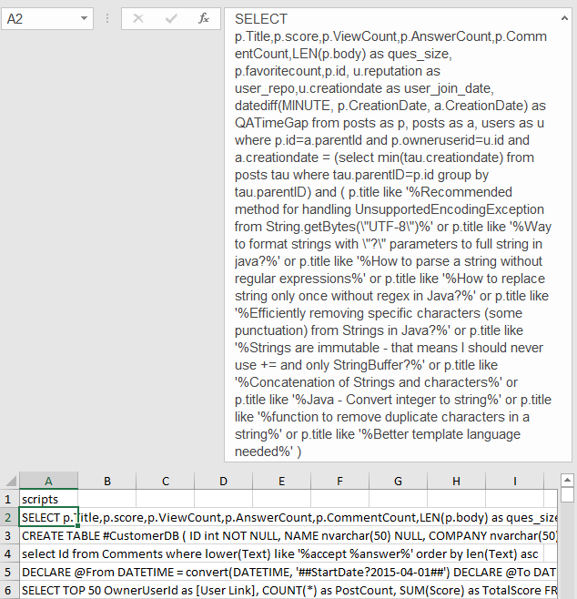
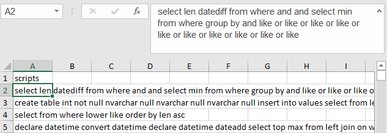
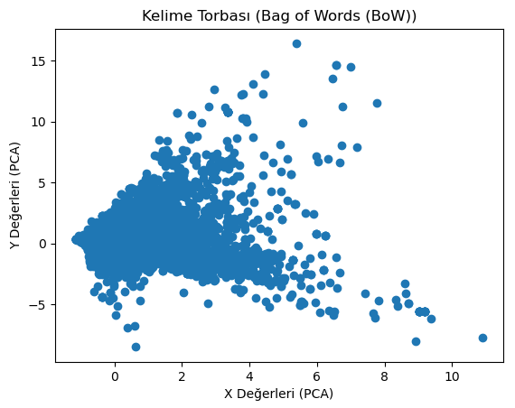
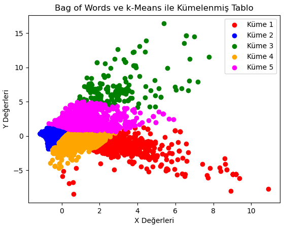
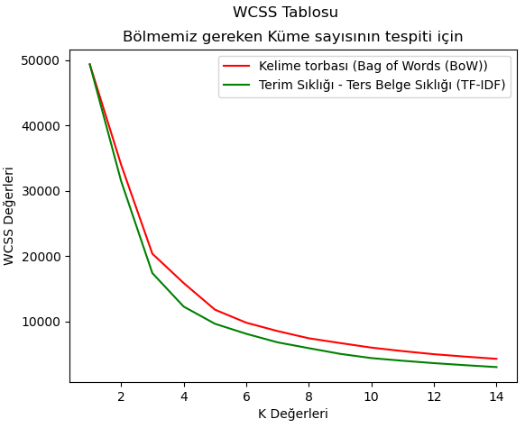
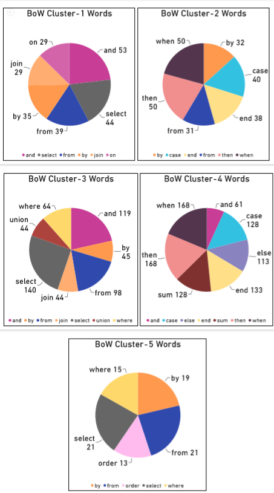
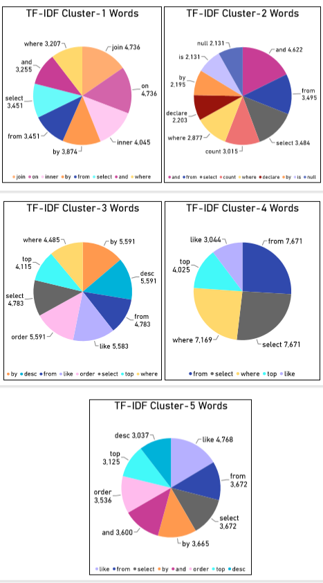
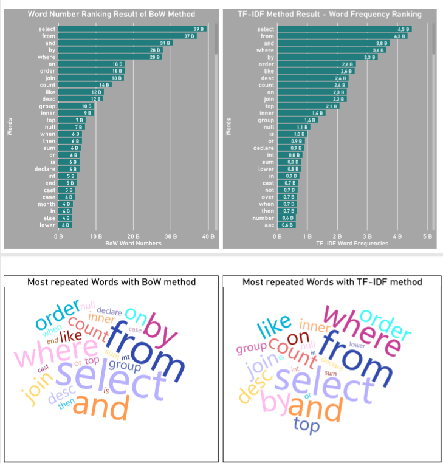
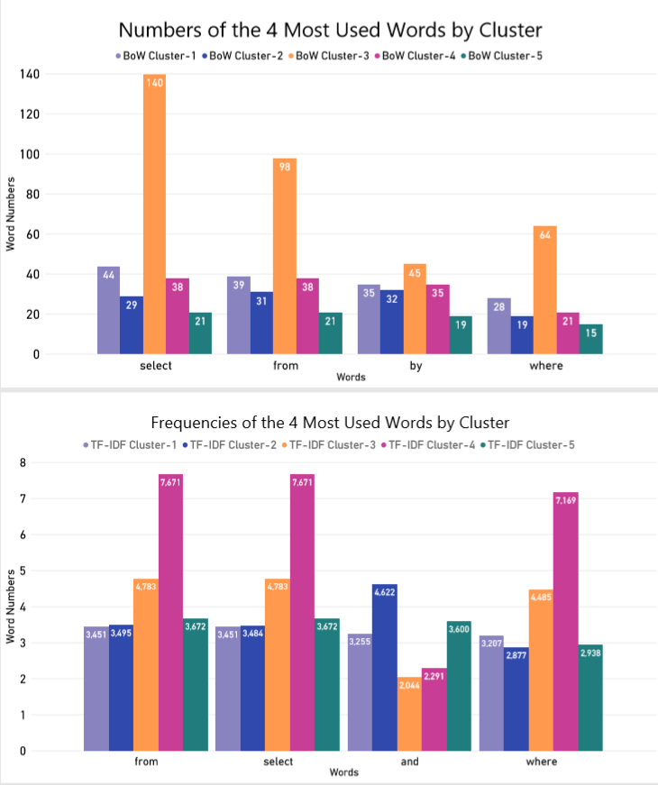

# Analysis of SQL queries based on similarities

## The Project of Goal

The Graduating Project we completed with a team of two includes analysis of SQL Queries with Text Mining.

## Project Process

>**Data Processing**

We accepted thousands of SQL query strings, which we wrote and which were found from certain sources, as Text. 
And applied '[Data Processing](https://github.com/senaokusluk/Analysis-of-SQL-Queries-based-on-similarities/blob/master/Tez%20Projesi/Tez%20Projesi/asil_onisleme.py)' to these Textual data.

 

*Uncleaned Data*

*Cleaned Data*

>**NLP Approaches and Clustering**

The data were converted into numerical data with [Bag of Words (BoW)](https://github.com/senaokusluk/Analysis-of-SQL-Queries-based-on-similarities/blob/master/Tez%20Projesi/Tez%20Projesi/bow_kume_bilgi.py) and [TF-IDF](https://github.com/mertcankarakaya/Analysis-of-SQL-queries-based-on-similarities/blob/master/tfidf_kume_bilgi.py), which is one of the Natural Language Processing methods.
Clustering was carried out by [k-Means algorithm](https://github.com/senaokusluk/Analysis-of-SQL-Queries-based-on-similarities/blob/master/Tez%20Projesi/Tez%20Projesi/kumeleme.py) of Machine Learning. 

*BoW Data*

*BoW Clustered*

*TF-IDF Data*

*TF-IDF Clustered*

>**Cluster number decision**

It was deemed appropriate to divide it into 5 clusters using the [WCSS (In-Squares Total)](https://github.com/senaokusluk/Analysis-of-SQL-Queries-based-on-similarities/blob/master/Tez%20Projesi/Tez%20Projesi/wcss_hesaplama.py) method.

*Result of WCSS*

>**Result**

In order to understand that clusters are separated according to their similarities, each cluster is visualized and analyzed with Power BI. 
As a result, the values within each cluster are different.

[Power BI](https://github.com/senaokusluk/Analysis-of-SQL-Queries-based-on-similarities/blob/master/powerB%C4%B1.pbix) results obtained are shown below.

***Result of Power BI***

*BoW Cluster chart*

*TF-IDF Cluster chart*

*Most worlds*
